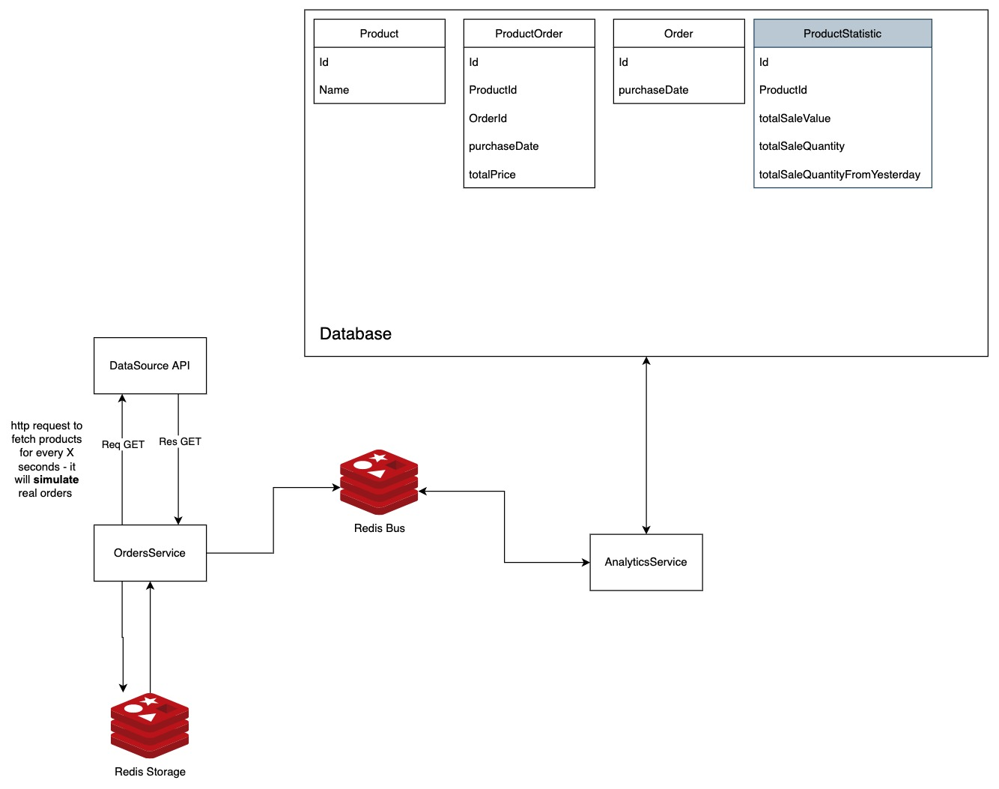
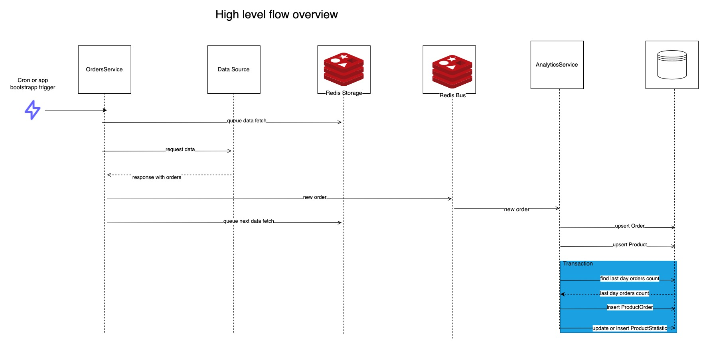

## About solution

I absolutely can’t say that it is a complete solution for a given task. **It is more a concept**.
I hope it will show my understanding for given problem.

My main goal in this task was to optimize query response time to minimum.
The goal has been achieved by creating ProductStatistic table which stores current statistics about a given product.



Orders Service fetches data from given external endpoint. Data is being fetched page by page. App creates a recurrent (recurrent because one job crates another) job in
Redis Storage service. In general this orders service simulates service where real queries like `POST /order` could be run.
Nevertheless currently this service fetches data from external source. As i described before it is asynchronous process. Data fetch
is triggered every app start and by cron EVERY MINUTE, but if in queue already is a job which fetches orders, new job won't be added.


Analytics Service is a place where data is being processed. Here appropriate records in database are being created and updated.
This service also merges duplicated products in order's item array.
Analytics service exposes also three endpoints which was required.
- `GET /order-analytics/top-profitable-products`
- `GET /order-analytics/top-bought-products`
- `GET /top-bought-products-yesterday`

Swagger docs for these endpoints are available under `http://localhost:3002/api` (accessible after app start)

Data for these endpoints comes from ProductsStatistics table. 
Thanks to this table i don't have to query `ProductOrder` table every time when i want to fetch analytics data. Now when i want to get TOP 
bought products i will get this data almost instantly.

However my another idea for solution was to maintain only first three tables (Product, ProductOrder, Order).
In this scenario i would create some indexes on ProductOrder table which will also bring me to almost "Instant response time".
Neverthereles even with these indexes response could take some time if we will have massive amount of data inside `ProductOrder`.
So solution without `Statistic` table could be easier but this is more scalable and faster in general.

Orders and Analytics service are connected by Redis, they are exchanging orders data. Orders Service plays as a producer and Analytics service is consumer.

Of course there is **A LOT OF THINGS TO DO**:

I'm aware of:
* lack of testing (unit and integration)
* messy codebase
* lack of logging
* lack of complex documentation
* Implementing three almost the same endpoints is not ideal, i think it would be better to stay with one endpoint which will take some query parameters
(atm every endpoint returns almost the same response sorted by another way)
* When we would like to stay with monorepo in real environment i would like to use software like Nx workspace,
thanks to it we will be ablo to share some codebase in easy way

**However, I believe that so short time (< 2MD) was too short to prepare complete solution.**


I have some feedback for data source api:
* Products inside one order shouldn't be duplicated, i guess
* there should be validation for query parameters to prevent requests with eg. `_page=-042133490`

### High level data flow overview:



## Services

### OrdersService

- port = `3001`
- debugPort = `9229`

### AnalyticsService

- port = `3002`
- debugPort = `9239`

### RedisBus

- port = `6379`

### RedisStorage

- port = `6389`

### PostgresAnalyticsDb

- port = `5432`

## Running locally

1. Create .env file in both services.
2. Fill them with necessary variables (according to validator
3. Install npm packages with both services - `npm i`
4. Run

```shell
docker-compose up
```
